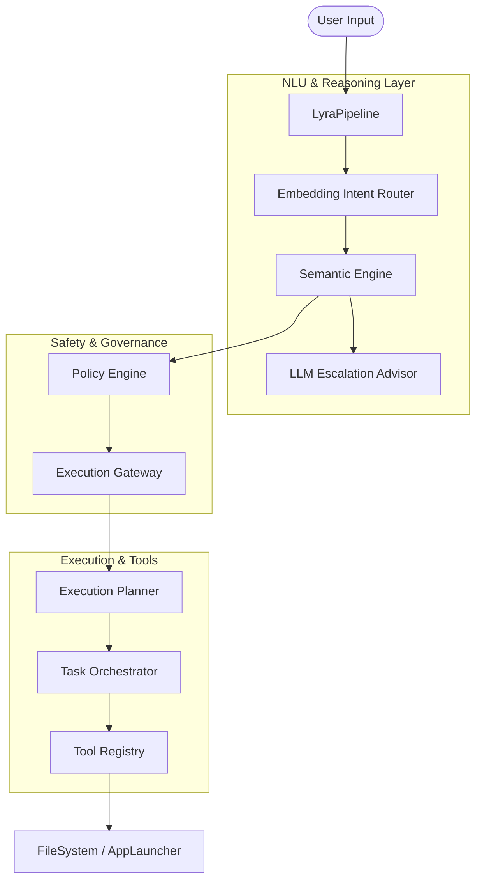

# Lyra AI System Architecture

This document details the architecture and data flow of the Lyra AI Operating System, focusing on the hardened design implemented in Phase X3.

## System Overview

Lyra is a resource-aware, safety-first AI assistant designed for local execution. It follows a modular architecture where heavy cognitive components are lazy-loaded and strictly governed by a resource monitor.

## Core Components

### 1. LyraPipeline (`lyra/core/pipeline.py`)
The central orchestrator that coordinates all subsystems. It manages the session memory, integrity watchdog, and ensures every command passes through the security gates.

### 2. Embedding Intent Router (`lyra/semantic/intent_router.py`)
Uses `sentence-transformers` (all-MiniLM-L6-v2) for fast, low-memory intent classification. It includes a RAM guard to prevent loading on systems with < 3.5GB available memory.

### 3. Semantic Engine (`lyra/semantic/semantic_engine.py`)
Responsible for parameter extraction and structural validation.
- **Feasibility Check**: Validates if the requested parameters (e.g., file paths) are valid before execution.
- **Confidence Engine**: Triggers LLM escalation if NLU confidence is low.

### 4. 2-Layer Safety Model
- **Policy Engine** (`lyra/policy/policy_engine.py`): Validates if the User/Capability has rights for the specific `intent`.
- **Execution Gateway** (`lyra/execution/execution_gateway.py`): Performs real-time risk assessment (LOW/MEDIUM/HIGH) and enforces Human-in-the-Loop (HITL) for dangerous operations.

### 5. Task Orchestrator (`lyra/orchestration/task_orchestrator.py`)
Handles complex, multi-step goals detected in `DEEP` reasoning mode.
- **Autonomous Loop**: Generates a step-wise plan and executes it, re-verifying safety for every individual step.
- **Loop Prevention**: Automatically rejects plans with repeating intents.

## Data Flow

1. **Detection**: Input is normalized and run through the `EmbeddingIntentRouter`.
2. **Expansion**: `SemanticEngine` extracts parameters.
3. **Escalation (Optional)**: If ambiguous, the `LLMEscalationAdvisor` (Local LLM) provides a structured plan.
4. **Governing**: The command is matched against `CapabilityRegistry`. If it violates capability risk floors, it is blocked.
5. **Execution**: The `ExecutionPlanner` resolves dependencies and executes via the `ToolRegistry`.

## Resource Management

Lyra implements a "Single Heavy Model" rule via the `LocalLLMManager`. Only one heavy model (Embeddings or LLM) is encouraged to stay in RAM at once, with aggressive idle-unloading timers (2-3 minutes).
