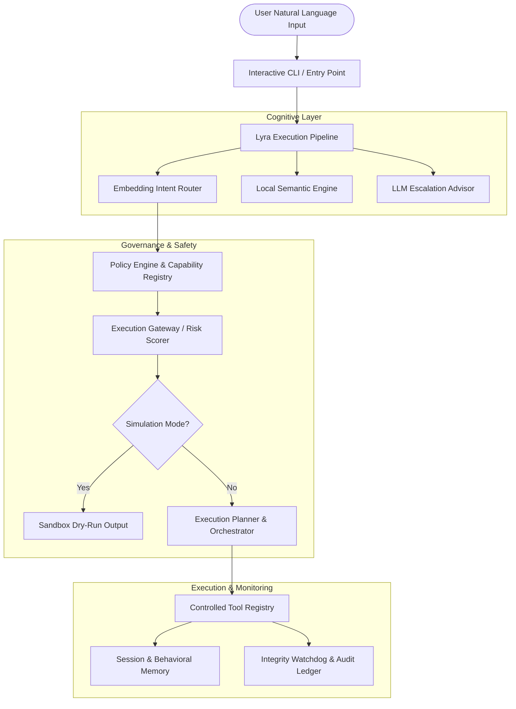

# Lyra — Local-First Personal AI Operating System

> **Status**: 🟡 Active Development / Experimental  
> **License**: MIT License ([LICENSE](LICENSE))  

Lyra is a local-first personal AI operating system designed around semantic intent routing, safe automation, planning, context memory, and resource-aware model execution.

---

## Overview

Most AI assistant projects stop at calling an LLM endpoint and streaming natural language text back to the user. **Lyra** addresses the harder systems engineering problem: **How can an AI assistant translate intent into explainable, controlled, and safe actions on local hardware without exhausting system memory?**

Lyra implements an offline-first pipeline around the model rather than treating the LLM as the entire application. It integrates intent classification, capability registration, policy engines, execution gateways, dry-run simulation, and multi-tier memory management.

---

## Why I Built It

Lyra is my first large, long-running systems project. I built it to explore local AI execution, systems architecture, security policy enforcement, and autonomous agent orchestration. Developing Lyra on a resource-constrained hardware setup (8GB RAM) forced resource management, lazy model loading, and idle unloading to be designed as first-class architectural concerns.

---

## Architecture & Data Flow



For comprehensive technical specifications, see [`PROJECT_ARCHITECTURE.md`](PROJECT_ARCHITECTURE.md) and [`documentation/`](documentation/).

---

## Key Features & Systems Design

- **Local-First & Offline Intent Routing**: Combines lightweight regex/rule matching with an optional embedding-based intent router (`all-MiniLM-L6-v2`) for offline intent classification before attempting cloud escalation.
- **Resource-Aware Heavy Model Management**: Implements explicit memory safeguards in `default_config.yaml` (`max_ram_usage_gb: 4.0`, `warn_threshold_gb: 0.8`, `memory_guard_min_free_gb: 0.8`), lazy component loading, and automatic idle model unloading.
- **Safety Policy & Capability Governance**: Enforces single-ownership intent mapping in `CapabilityRegistry`, pre-execution policy checks, risk scoring (`SAFE`, `LOW`, `MEDIUM`, `HIGH`, `CRITICAL`), and human confirmation gates.
- **Dry-Run Simulation Gateway**: Supports simulated dry-run execution (`simulate <command>`) allowing users to preview planned side effects before granting execution permission.
- **Autonomous Task Orchestration**: Decomposes multi-step goals into validated steps managed by `ExecutionPlanner` and `TaskOrchestrator` with `RollbackManager` integration.

---

## Technical Stack

| Domain | Technologies |
|---|---|
| **Core & Runtime** | Python 3.10+, PyYAML, `psutil` |
| **Semantic & ML** | `sentence-transformers` (`all-MiniLM-L6-v2`), `numpy`, `scikit-learn` |
| **LLM & Escalation** | Google Generative AI (`gemini-1.5-flash`), Ollama API (`qwen2.5:3b`) |
| **Storage & Memory** | SQLite (`data/memory.db`, `data/behavioral_memory.db`), JSONL outcome logs |
| **Testing & Quality** | Python standard `unittest` framework |

---

## Repository Structure

```
Lyra-AI-Mark3/
├── config/
│   └── default_config.yaml    # System configuration & RAM guard thresholds
├── data/
│   └── tool_registry.json     # Declarative tool definitions
├── documentation/
│   ├── architecture.md        # Technical architecture specs
│   ├── design_decisions.md    # Architectural decision records (ADRs)
│   └── task_roadmap.md        # System roadmap and task progress
├── lyra/
│   ├── capabilities/          # Capability mapping & permission definitions
│   ├── cli/                   # Interactive CLI interface
│   ├── context/               # Context normalization & clarification service
│   ├── core/                  # Main execution pipeline & integrity watchdog
│   ├── execution/             # Execution gateway, rollback, & permissions
│   ├── llm/                   # Ollama & Gemini adapters, escalation router
│   ├── memory/                # Session memory & context compression
│   ├── orchestration/         # Autonomous task orchestrator
│   ├── planning/              # Step decomposition & execution planner
│   ├── policy/                # Policy engine & governance rules
│   ├── reasoning/             # Intent detection & command schemas
│   ├── safety/                # Risk scoring, simulation, & audit ledger
│   ├── semantic/              # Intent router & local semantic engine
│   └── tools/                 # Tool implementations (file, system, web)
├── tests/
│   └── test_pipeline.py       # Automated unit test suite (4 core tests)
├── LICENSE                    # MIT License
├── requirements.txt           # Dependency requirements
└── setup.py                   # Package setup & console scripts
```

---

## Installation & Setup

### Prerequisites
- Python 3.10+
- 8GB RAM system (configured to cap runtime usage at 4.0GB max)

### Setup Virtual Environment

```bash
# Clone repository
git clone https://github.com/Balu-Annapureddy/Lyra-AI-Mark3.git
cd Lyra-AI-Mark3

# Create virtual environment
python -m venv .venv

# Activate virtual environment
# Windows (PowerShell):
.\.venv\Scripts\Activate.ps1
# Linux/macOS:
# source .venv/bin/activate

# Install dependencies
pip install -r requirements.txt
pip install -e .
```

---

## Usage

Start the interactive CLI loop:

```bash
# Using installed console script
lyra

# Or directly via module entry point
python -m lyra.main
```

### CLI Commands

```text
Commands:
  - Type your command naturally (e.g. create file notes.txt with content "Meeting notes")
  - Type 'simulate <command>' for dry-run simulation
  - Type 'history' to view recent command history
  - Type 'logs' to inspect execution audit logs
  - Type 'metrics' to view runtime performance statistics
  - Type 'help' for available command examples
  - Type 'exit' to quit
```

---

## Testing

Automated tests are located in `tests/test_pipeline.py` (4 unit tests covering pipeline initialization, intent detection, dry-run simulation, and capability registry).

Run the test suite using Python's built-in `unittest`:

```bash
.\.venv\Scripts\python.exe -m unittest discover tests
```

---

## Limitations

- **Experimental Subsystems**: Task orchestration and deep multi-step reasoning are under active development.
- **Hardware Boundary**: Running local LLM inference via Ollama requires an external Ollama daemon; cloud escalation via Gemini API requires a `GEMINI_API_KEY`.
- **Tool Sandbox**: File operations run with system permissions; destructive operations require user confirmation.

---

## Roadmap

- [x] **Phase 1: Core Architecture & Safety** — Pipeline design, intent detection, capability registry, policy gate, dry-run simulation, unit testing.
- [ ] **Phase 2: Advanced Context & Memory** — Deep context compression, proactive memory retrieval, behavioral adaptation.
- [ ] **Phase 3: Robust Multi-Agent Orchestration** — Parallel subtask delegation with automated rollback verification.

---

## License

This project is licensed under the MIT License — see the [`LICENSE`](LICENSE) file for details.
